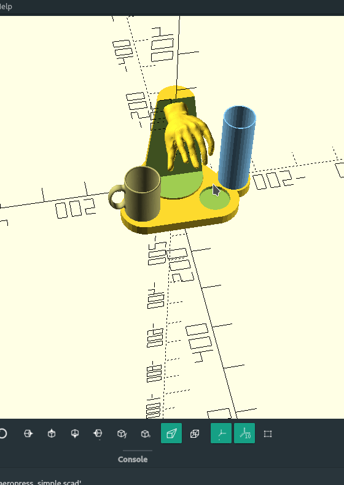

# pivoting aeropress interface. v0

prep:
1. fill reservoir
2. ground beans and filter in ap, insert pump as far as possible
3. attach to alarm
4. sleep

automated steps:
1. alarm attaches bottom of ap to a slit in the base.
2. by moving the pump up while the bottom is attached to the base, the ap should suck water from the reservoir.
The water should be piped through a heating system, or heated in advance.
3. after the ap is filled up, the alarm detaches the ap from the base and lets it sit for 30 seconds
4. alarm shakes ap (should make for better coffee)
5. alarm places ap on top of cup and starts pressing
6. you wake up
